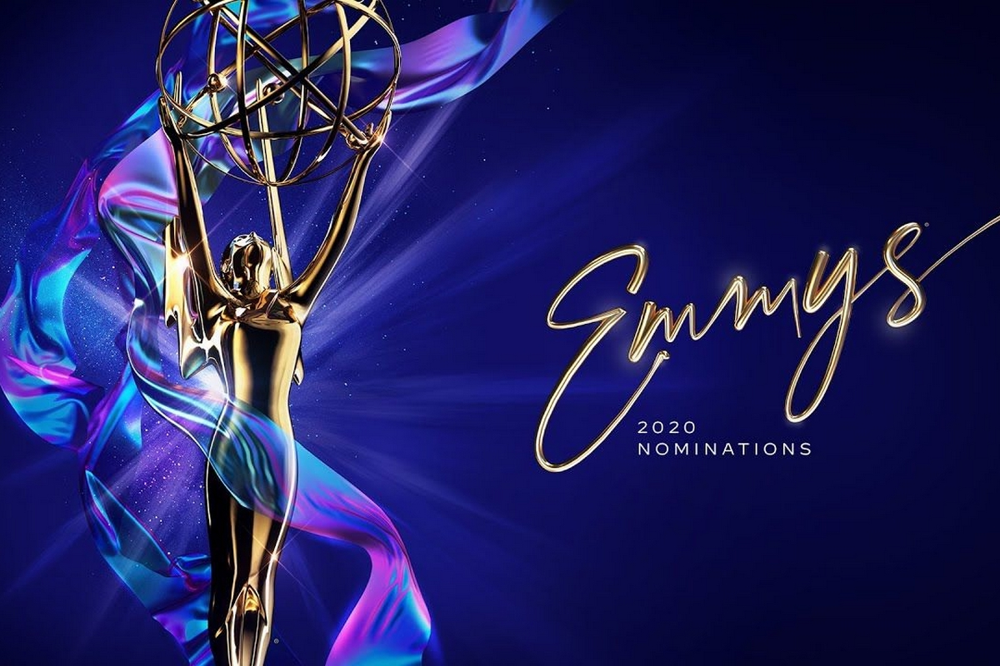
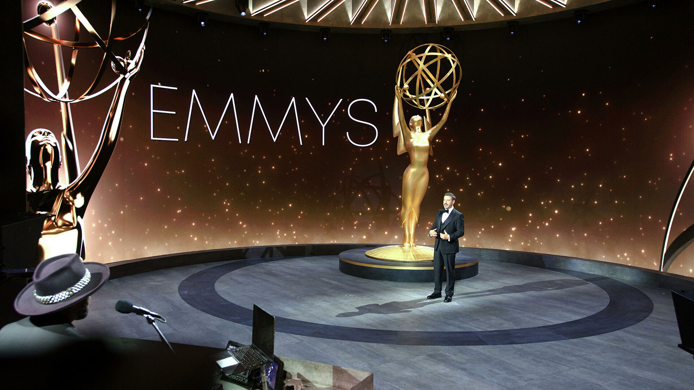
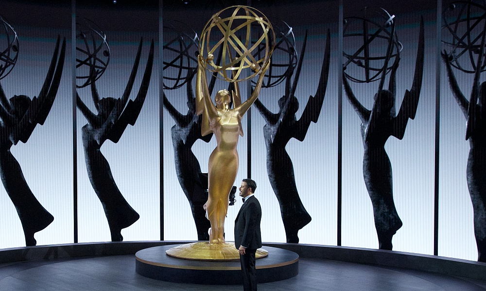

# "Emmy 2020: The winners of the 72nd Ceremony

At the 72nd Emmy Awards ceremony, HBO's Heirs won the Best Drama Series nomination. The creator of the project Jesse Armstrong received the award in a London hotel room, and in his speech of gratitude mentioned U.S. President Donald Trump and Coronavirus. "No thanks to the virus for separating us all this year. No thanks to President Trump for his vile and poorly coordinated reaction to the situation," the writer said. - And no thanks to the media magnates who are doing so much to keep these people in power.

Shitts Creek was chosen as the main comedy series, which also won prizes for the best female and male roles in the comedy project.

This year "Guardians" were leading in the nominations. As a result, the series took four awards - in addition to "Best Mini-Series", the project won in the categories "Best Female Role in a Mini-Series or a TV movie," "Best Male Role in a Mini-Series or a TV movie" and "Best Screenplay Episode Mini-Series.

Among the channels presented at the "Emmy-2020", the most awards collected HBO - 11. Of these, four were on "Heirs" and four - on "Guardians". The comedy series "Shitts Creek" brought seven prizes to Pop TV channel. Netflix this year limited itself to two wins - for the series "Ozark" (Julia Garner) and "Unorthodox", which was awarded for best director of an episode of the mini-series.

## The list of winners looks as follows:

### Best drama series:

- "The Heirs"
- "Better call the Saul."
- "The Crown"
- "The Maid's Tale"
- "Mandalorean"
- "Killing Eve."
- "Very strange things."
- "Ozark"

### The best comedy series:

- "Shitts Creek."
- "Die your enthusiasm."
- "Dead to me."
- "The White Crow"
- "Cominsky's method."
- "The Amazing Mrs. Maisel."
- "In a better world."
- "What we do in the shadows."

### The best mini-series:

- "Guardians"
- "And the fires are smoldering everywhere."
- "Mrs. America."
- "Unbelievable."
- "Unorthodox."

### Best TV movie:

- "Perfect."
- "American son"
- "El Camino: All heavy."
- "Unbreakable Kimmy Schmidt: Kimmy vs the Reverend."
- "Dolly Parton's Soul Strings."

### Best male role in a drama series:

- Jeremy Strong - "The Heirs".
- Jason Bateman - "The Ozark"
- Sterling C. Brown - "This is us"
- Steve Karell - "Morning Show"
- Brian Cox - "Heirs"
- Billy Porter - "Pose"

### The best female role in the drama series:

- Zenday - "Euphoria"
- Jennifer Aniston - "Morning Show"
- Olivia Coleman - "The Crown"
- Laura Linney - "The Ozark"
- Sandra O - "Killing Eve"
- Jody Comer - "Killing Eve."

### Best supporting male role in a drama series:

- Billy Krudap - "Morning Show".
- Giancarlo Esposito - "Better call the Saul."
- Matthew McFadian - "Heirs."
- Kiran Kalkin - "Heirs"
- Nicholas Brown - "Heirs"
- Bradley Whitford - "The Maid's Story"
- Jeffrey Wright - "World of the Wild West"
- Marc Duplass - "Morning Show"
